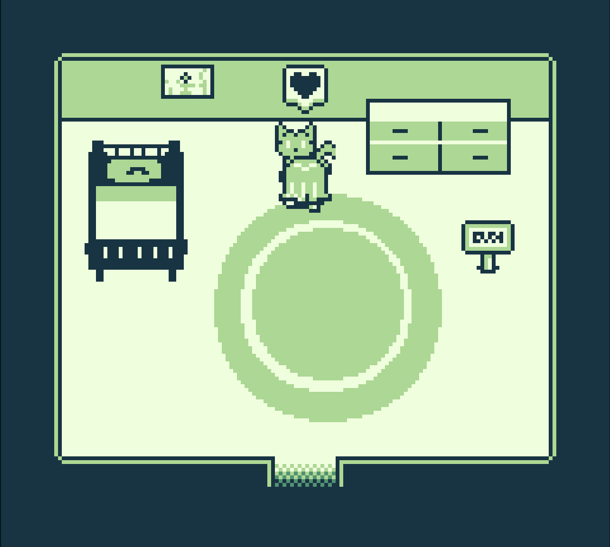
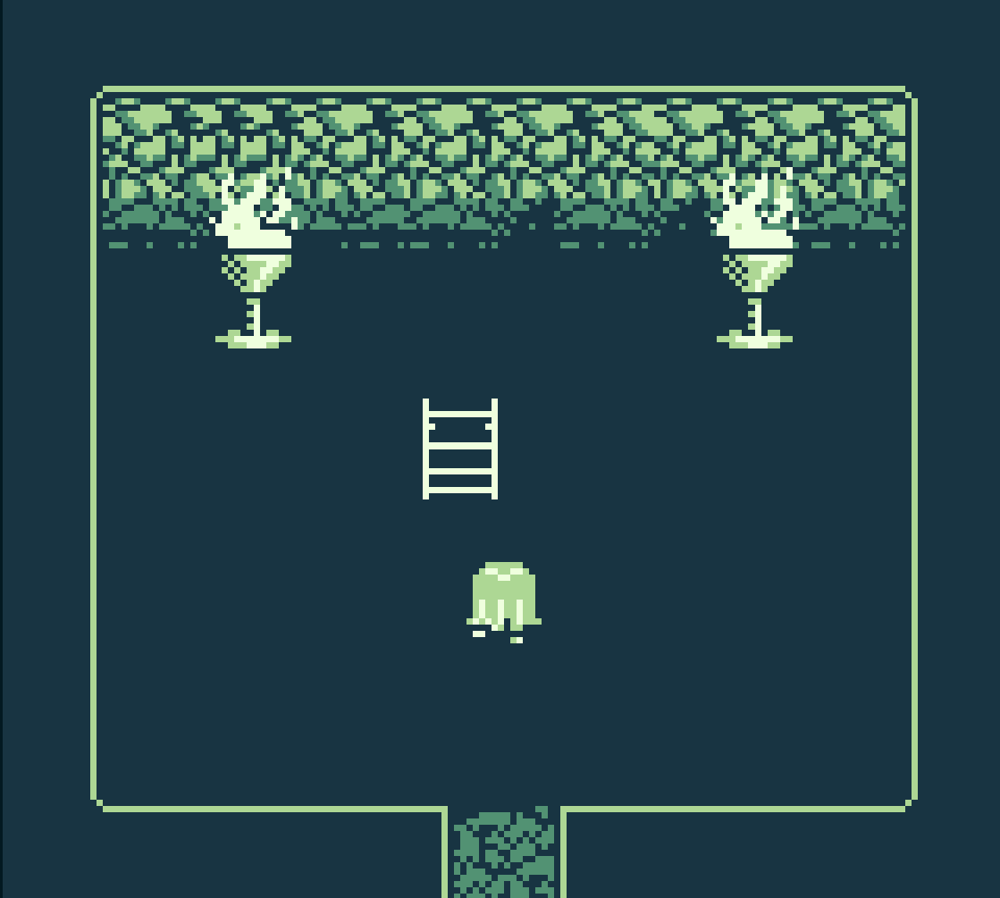
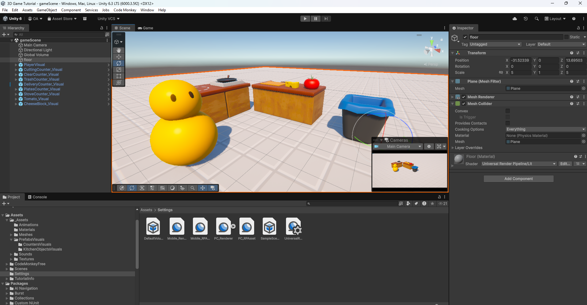
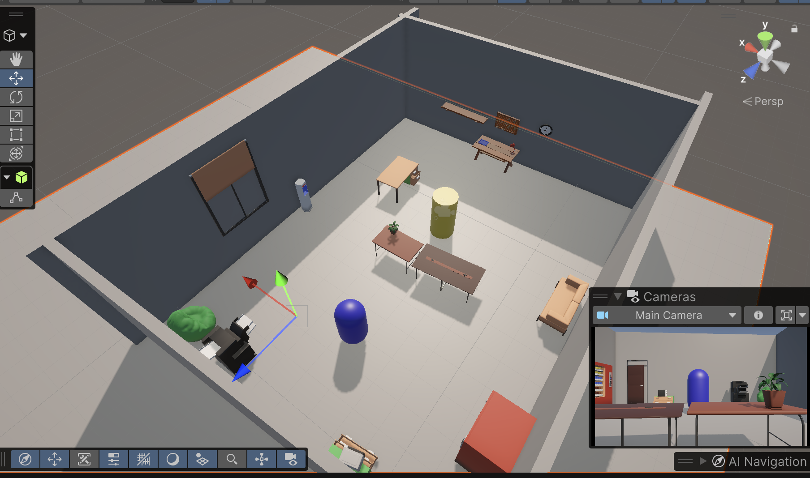
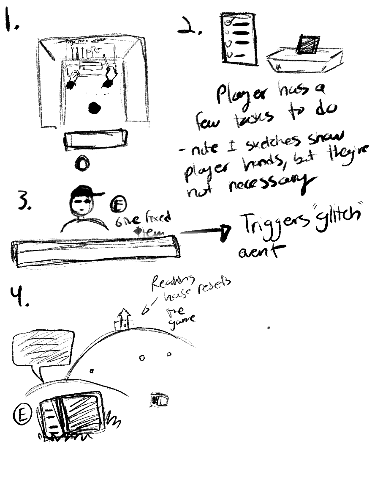
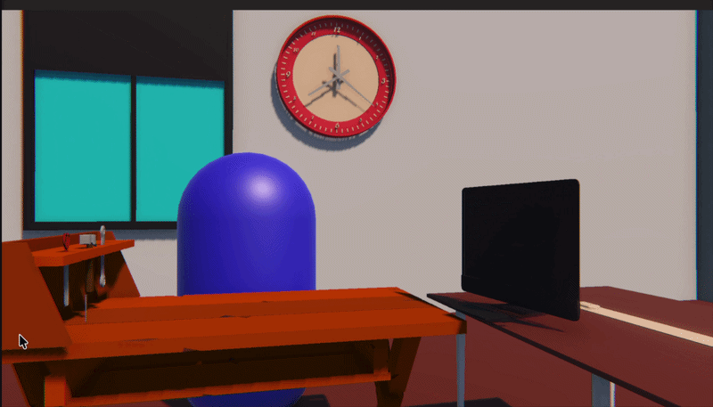
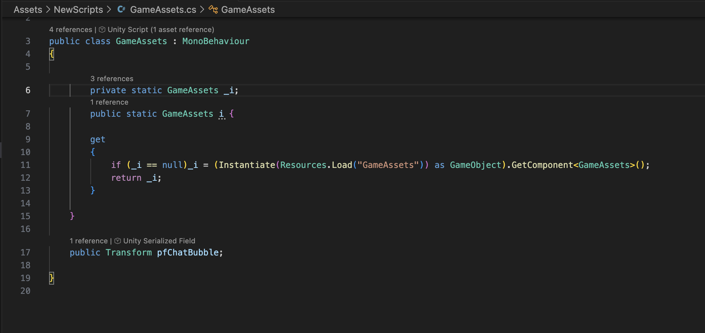
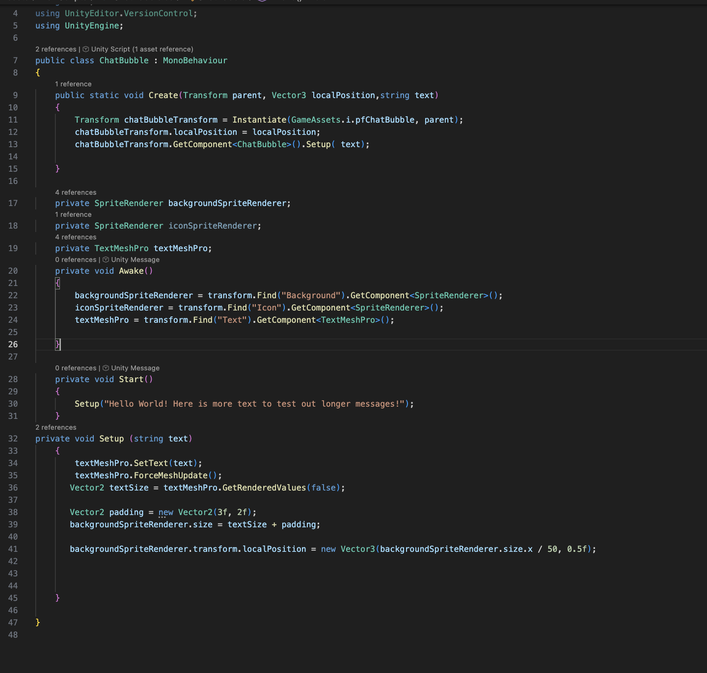
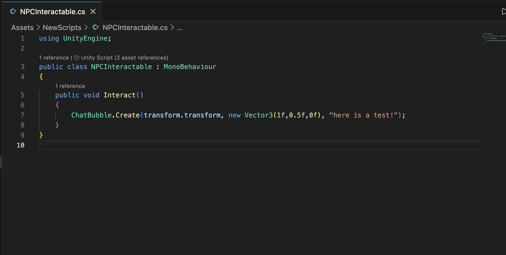

# Olivia Axiuk Game Prototyping Journal CART 315

## Make a Thing | Due 2026-01-21

### Intro

For this week, our task was simply to “make a thing” using the provided
beginner-friendly game engine tools to make a limited-scope project. Due to my current interest
in retro consoles, the possibility of making a GameBoy compatible game with GameBoy Studio
was very appealing. As well, the promise of a beginner-friendly “drag and drop” style engine
piqued my interest. Although I have created small game-like applications in the past using
mainly JavaScript, I liked that GameBoy Studio provided the opportunity for quick
experimentation while providing ready-made and easily editable assets to jumpstart the process.

### Positive Thoughts

To begin creating this project, I explored the template game given by GameBoy studio,
studying the way that the player interacted with objects and characters, opening the code and
getting to know the program. I decided that my idea would be a quaint game where the player
explores a small town, helping with everyday tasks given by the NPCs. Having some prior
coding knowledge, I found the interface of GameBoy studio especially easy to use, simplifying
coding terms and often-used functions into simple drop-down menus. At the beginning of the
process, I found the experience overall pleasant, easy to use and encouraging for someone
relatively new to gamemaking.

### Issues

However, one glaring issue severely slowed down my process and, unfortunately,
negatively affected my enjoyment of the GameBoy Studio process. A strange issue arose that
affected the program’s ability to compile the game. It became very frustrating when I would
make changes to my game, but find myself unable to see them applied. The problem seems to be
a common one with GameBoy studio, which does, as of now, not have a solution. I had to find
workarounds for the glitch, but every solution would only work for a short amount of time before
my game would stop compiling again. As a result, many hours I would have spent working on
the actual gameplay were instead allocated to fixing this problem, and the scope of my game was
greatly minimized.

### Finally

Of course, not all was in vain. I found that bringing in the provided assets into Photoshop,
where I edited them to suit my game better, provided an opportunity to study and modify
game-ready pixel art. As well, the experience was also a lesson in planning and anticipating for
glitches and setbacks, something inevitable during the game making process. Overall, the “Make
a Thing” project still introduced me to a new way of making games, and the program was fun
enough to use that I would be willing to give it a second chance.

## Journal 02 | Due 2026-01-29

## Trouble getting started

For my first design journal, I intended to follow a tutorial based on player movement, colliders, and other basic game functions as we did not get to these topics during the class session. However, I unfortunately ran into many technical issues which hindered by ability to complete the tutorial. In a way, my situation is very in-line with my first design journal, as I did not anticipate to have issues installing Unity on my device. Hopefully I will have the installation working soon, however, it is nonetheless another early lesson in planning to allocate time for these types of setbacks.

## Plans Moving Forward

Of course, my main priority at this moment is to get Unity working on my computer. I still plan on following the tutorial that I have chosen once this is done. The end result should be a simple 2D "catch-all" game, complete with a Game Over screen, an amount of time played, and custom sprites. Although I have chosen this tutorial due to its ability to teach basic technical aspects, I would like to use this knowledge to expand into a game genre that I am more interested in, which is the RPG. I can see how the implementation of sprites, colliders and point systems can easily translate over into other game genres, and I would like to slowly build around the 2D format in order to create a story-driven, immersive experience. 

## Setting Goals

For next week, I would like to have finally ironed out my major technical issues and have started building some sort of base for a project I care about. There are a few projects which come to mind in terms of ideas I'd like to bring to life, and the possibility of expanding on them is very exciting. I will begin by having the scaffolding of a project for next week before mapping out fully fleshed out ideas. There needs to be sand in the sandbox before a castle can be built!

The tutorial I aimed to follow: https://youtu.be/xx1oKVTU_gM?si=0jEpK0FzO9lbCpPR

## Journal 03 | Due 2026-02-05

## Finally some fun in Unity!

This week, I was finally able to follow a tutorial in Unity without any technical difficulties. I am pleased with the fact that I was able to explore Unity's different editing capabilities, such as the animation editor and post processing as well beginning to code some basics, like player movement. Not only was I able to recall and apply the basics taught in class, but the tutorial also emphasized some best practices when it comes to keeping code and Unity projects clean; such as always parenting player visuals to an empty object, keeping visuals and logic separate. It was also satisfying to use the pre-made assets and to play around with post processing effects, creating something that actually looked like the beginnings to a game. 

The tutorial itself is around 10 hours long, and so far I've only gotten around 2 hours in or so, but it definitely seems like a very valuable resource to continue to study and to go back to, especially regarding 3D game-making. Speaking of which, I am leaning towards making a 3D style game as I continue forward. 

## Grand Ideas

For my game concept that I would like to develop into a working prototype, I've been thinking of creating something that lies between a cozy game and a low-poly style horror game. The main idea is that the player takes the role of a tech-repair person, fixing customer's TVs, consoles, etc. However, they would soon realize that strange things begin happening around the shop, due to some of these devices being haunted. Through these pieces of technology, the player will be able to find out more about the customers and their devices. As well, each successful 'repair' would in return give the player money to upgrade not only their tools, but also the aesthetics of their shop.

My main prioritized with this project as I flesh it out are:
- To decide which mechanics are most meaningful to the game
- to set realistic goals for development
- to develop a clearer idea of basic player mechanics

My secondary priorities would be:
- To develop the visual style
- To strategize how to balance the "cozy" and nostalgic elements with the horror ones.

I know that making the entire game within a few weeks would be near impossible, so I want to keep my goals concrete and realistic. I would like to have a short, working demo by the end of the semester which shows basic functionality and basic visuals to get the gameplay feeling across. In other words, I'd like to have a working base that I could build off of in the future.

Here is a small moodboard and some quick sketches I made while brainstorming

Followed tutorial: https://www.youtube.com/watch?v=AmGSEH7QcDg&t=5376s

## Journal 04 | Due 2026-02-12

## Setting Goals for the week

My main goals for this week are:
- Set up a Unity project, get basic movement and interaction system done or in progress (this can include player and NPC interaction)
- Using premade assets, set up a basic environment to begin exploring potential player experience.

## Progress on Goals

For this week, I've finally started building the project in Unity. To get a feeling for the player experience, I've implemented a simple 3D first-person camera and movement system with gravity, as well as a script that allows for the player to interact with objects posessing a collider. The most important part for me is that now I can begin to iterate on different sets and UI setups, creating different levels almost as "sketches" in order to better feel out what functionality I will need in terms of scripting down the line. In other words, I've met my goals.

The only issue right now is that setting up a more complex interaction system that is modular will take much longer than I anticipated. Although the character can detect NPCs and objects with a collider, I found that the dialogue and UI elements that come with it require more back-end code, including a sustem to handle all these different elements. This I will have to keep for later.

As someone who thinks visually, it'll be interesting to finally have an actual project to work with and explore different game feels. Of course, as the functionality is simple at this point the variations will mostly be visual for next week. However, I expect to build at LEAST one extra function every week. A function for me could be  big, like a interaction system or something more simple, like adding a UI "task list."

## Looking Foward

I know that the week coming up will be particularly busy, so I want to set goals that are reachable, but that will continue to help build a clearer idea of the game.

My thoughts for my goals are:

- Add movement to the NPC and assign dialogue specific to each one
- Do paper (or digital) drawn sketches of different game layouts
- Apply these in an iterative way as sketch levels 

## Journal 05 | Due 2026-02-19

## Rethinking Ideas

I've been rethinking my idea and overall goals for my project during the past week. Although I want a project I could build off of after, I also really want to have a result in the end that feels like a final piece. It's a lot easier to set goals and map out a timeline when I have a finsihed product in mind, rather than a more abstract goal of having "basic functionality." I also think that it'll be more motivating if I am working toward a finalized goal.

My idea remains largely the same in terms of theme. However, the experience of the game will go in this order:

1. A Player recieves an item to fix from a customer upon pressing play
2. They will have to go through a short list of fixes for the item, which will show as a UI list. This means that they will need to interact with the correct tools, and this will play a fixing animation
3. They will be prompted to give the item back to the customer (interacting by pressing E or enter)
4. A "glitch" cutscene will play. This would simulate a "haunting" that might happen in the final (previous) version of the game, but in this new version, it may be a cutscene, or perhaps a change of lighting and texture in the environment, leading to the player blacking out.
5. The final part of the game will be more exploratory in terms of gameplay. In my mind, the player will "wake up" and regain control via AWSD, and be introduced to a large expanse (probably a field) where they will be able to interact with different objects, abandoned technology, which will display a bubble of information upon interacting. This can be interpreted as an representation of the player's character state of mind. There will be a way of resetting the game by reaching a building or other landmark.

The following is an upload of my sketeches I did while brainstorming:

The new game still has a lot of the same mechanics, but is a bit tighter in scope in the fact that I can actually imagine exactly what I need to make and learn for this project. 

## Beginning Application

Becaue I've changed my idea, my goals changed a bit during this week. As well, I knew in advance (as I mentioned) that I would be busy and so, I decided to explore the last part of my new idea, the grassy field. The work for this lay mostly in trying to find the best way to create grass in Unity. I was looking for something stylized, yet still believable. I ended up doing some tests with the in-built terrain tools. After some work on adding the grass and the application of post-processing effects, I ended up with a style I really liked. 

The most prominent issue, unfortunately, is that this way of rendering grass seems to be heavy of the system. I will need to see if there is a way of opmitizing the system. 

## Returning to Goals

For next week, I know I will finally have more time to allocate to this project. An so, going forward I'd like to at last get to building an interaction system, complete with dialogue/descriptions for interacted objects, as this will be the main way a player will acquire information.

## Journal 06 | Due 2026-02-26

## Ideation

During last class, the ideation workshop brought up some very interesting and unexpected ideas. Two ideas which I thought were the strongest were:

1. A game which followed the story of a patient at a hospital, who passes between the world of the living and the dead, as the player acts as two different nurses, one human and one a ghost, as they try together to keep the patient alive, and bring their soul from the land of the dead back to their body. This game would play with different mechanics on either side of life and death.

2. Something much more lighthearted, this game would follow the player as the new owner of an antique store, in which all the "souls" of the old objects come to life as interactable NPCs with their own stories and personalities. Using similar mechanics to a 'dating sim', a player would build relationships with the object characters only to (plot twist!) find out that the stronger the relationshp with a character, the more their related object would sell for in their store. A player would have to balance selling objects, mainting relationships, and navigating the overall story.

As much as I liked these two ideas, I find the first one to be still relatively vague in its design, though thematically strong and poignant. The second is much more developped, and I could very easily see how it could be adapted into a real project, especially since it bases itself off of well-established mechanics. However, as much as I found these ideas intriguing, I still did not feel that passionate about them. As well, a bigger factor in me not choosing these ideas is that the partner I was with for both ideas asked to use the ideas potentially for their own projects, which I was fine with.

## Design Values and Constraints

I think that I will continue to move forward with the idea that I've been developing since the beginning of the journal. However, I am wondering whether it may be more interesting if, instea dof recieving an item and working on its physical repairs, it may be more interesting for the player to have to fix software-related repairs instead, sending the player to explore the files hidden within the machine. 

Design values:
- Atmosphere, Storytelling
- Smoothness of the experience
- Immersiveness

Constraints to Consider:
- time
Means: I will need to keep the scope of my project small. I only have a few weeks, so I need to look to reusing assets, building modular, multi-functinal code, and creating an experience that feels complete despite being short.
Solution: Limit scope, (potentially worked out last week)
- overall knowledge of C# and Unity
Means: Since I am still becoming familiar with the program I will be using, I want to keep the mechanics simple enough that I can continue learning and finding helpful resources while still building the experience. 
Solution: Stick to well-established game mechanics, use these tools in ways which will create a uniwue experience, while having resources to rely on
- Technical Constraints (machine power)
Means: While my computers are well set up for game-dev, there are still certain things that every machine will struggle with. For example, I mentioned the grass I made back in Journak 5 used Unity's inbuilt environment creator which struggled greatly with performance. This point can lead back to the time aspect as well. I will need to find ways to express the visuals in a way which will save time and will run on most machines.
Solution: Stick to simple styles. My idea right now would resemble the old PS1 style graphics of the 90s and early 2000s. To fill out the sets, I may need to rely on a limited amount of downloaded assets as well.

## Practical Application

For this week's practical application in Unity, I decided to finally set up an interaction system. Although this particular project is based on my original idea, the nice thing about this is that it can easily be built upon and managed to work with different projects. Below is an example of a player,NPC interaction, in which the result is a textbox appearing, assigned to the individual NPC.

Although this particular example creates a bubble, the expandability is created through this very simple code. Basically, it manages prefabs within the project, creating instances of them. 

This allows an instance to be called easily through code and, using the create function defined in the prefab, specific parameters can be defined for that specific instance. Below is the code displaying the create function for the text bubble, as well as the rest of the code.

Here, the create function is finally being called in the previously created NPC Interactable Script.

This system was created following a variety of videos from Code Monkey on YouTube namely this one: https://www.youtube.com/watch?v=LdoImzaY6M4&t=517s

## Goals

For next week, I really want to continue to build the interaction system, but I also want to focus more heavily on design work. I'd like to solidify my idea and create a list of the assets I will need to make.
